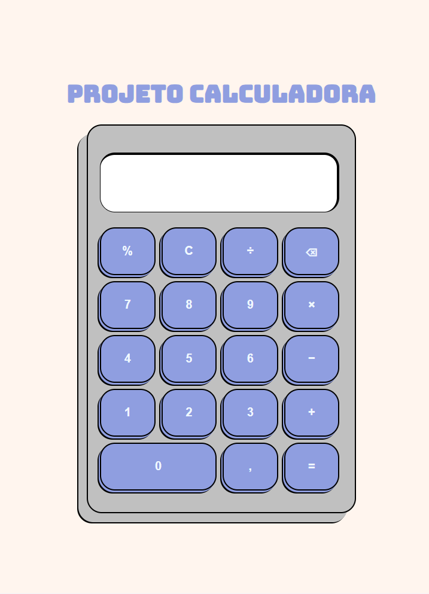

# 🧮 Functional Calculator

<p align="center">
  
  
  
</p>

A responsive web calculator built with **HTML, CSS, and JavaScript**.  
This project performs basic mathematical operations and percentage calculations, created to strengthen **programming logic**, **DOM manipulation**, and **responsive design skills**.

---

## 🚀 Live Demo

👉 https://devgfreitas.github.io/Calculator/

---

## 📸 Preview

<p align="center">
  
</p>

---

## ⚙️ Features

- ➕ Addition  
- ➖ Subtraction  
- ✖️ Multiplication  
- ➗ Division  
- 📊 Percentage calculation (e.g., 10% = 0.1)  
- 📱 Responsive layout  

---

## 🧠 What I Learned

- DOM manipulation with JavaScript  
- Handling user input and calculations  
- Building responsive layouts with CSS  
- Structuring a real-world project  

---

## 🔮 Future Improvements

- Support percentage in operations (e.g., `10 + 10%`)  
- Improve UI/UX design  
- Add full keyboard support  
- Implement calculation history  

---

## 🛠️ Tech Stack

- HTML5  
- CSS3  
- JavaScript  

---

## 💻 How to Run Locally

```bash
git clone https://github.com/devgfreitas/Calculator.git
